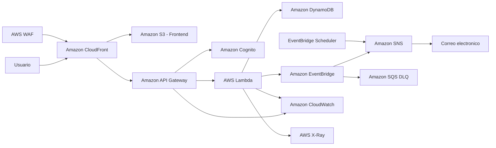

# Arquitectura de la aplicación Workshops

## 1. Descripción general

Workshops es una aplicación web serverless desarrollada sobre Amazon Web Services (AWS) para gestionar talleres de formación profesional.

La solución permite consultar talleres disponibles, administrar talleres, registrar estudiantes, autenticar usuarios según su rol y generar eventos y notificaciones asociados a las operaciones de la aplicación.

La arquitectura fue diseñada utilizando servicios administrados y serverless para reducir la administración de infraestructura, facilitar la escalabilidad y mantener los costos bajo control.

## 2. Diagrama de arquitectura

---

## 3. Componentes principales
Amazon S3

Amazon S3 almacena los archivos estáticos del frontend de la aplicación.

El bucket se mantiene privado y el contenido se entrega a los usuarios mediante Amazon CloudFront utilizando Origin Access Control (OAC).

Amazon CloudFront

CloudFront funciona como punto de acceso público de la aplicación.

Distribuye el frontend almacenado en Amazon S3 y también redirige las solicitudes realizadas mediante la ruta:

/api/*

hacia Amazon API Gateway.

URL pública del frontend:

https://d1z6gu4fgp8a7e.cloudfront.net/

Endpoint de API mediante CloudFront:

https://d1z6gu4fgp8a7e.cloudfront.net/api/workshops

Amazon API Gateway

Amazon API Gateway expone la API REST utilizada por el frontend.

Las principales rutas implementadas son:

GET /workshops
GET /workshops/{id}
POST /workshops
PUT /workshops/{id}
DELETE /workshops/{id}
POST /workshops/{id}/register

API Gateway también incorpora:

CORS.
Cognito Authorizer.
Request Validator.
Throttling.
Access Logs.
Integración con AWS Lambda.
AWS Lambda

AWS Lambda contiene la lógica de negocio del backend.

La función procesa las solicitudes recibidas desde API Gateway y realiza operaciones como:

Consultar talleres.
Crear talleres.
Actualizar talleres.
Eliminar talleres.
Registrar estudiantes.
Evitar registros duplicados.
Publicar eventos relacionados con la aplicación.

Función principal del entorno de desarrollo:

workshops-api-dev

También existen funciones administradas mediante Infraestructura como Código para los ambientes dev y prod.

Amazon DynamoDB

DynamoDB almacena la información relacionada con talleres y registros de estudiantes.

Se utiliza un diseño de tabla con claves:

PK
SK

Ejemplo:

PK = WORKSHOP#123

La solución también utiliza un índice secundario global para facilitar consultas adicionales.

Amazon Cognito

Amazon Cognito administra la autenticación de los usuarios.

Se definieron grupos y roles de aplicación:

Admin
Student

Los usuarios autenticados reciben tokens que son validados mediante Cognito Authorizer en API Gateway.

Las operaciones administrativas se encuentran protegidas según el rol del usuario.

Amazon EventBridge

EventBridge administra eventos generados por la aplicación.

Por ejemplo, cuando un estudiante se registra en un taller, Lambda publica un evento:

STUDENT_REGISTERED

El bus utilizado en desarrollo es:

workshops-events-dev

Una regla procesa este tipo de evento y lo envía al sistema de notificaciones.

Amazon SNS

Amazon SNS se utiliza para enviar notificaciones.

Topic principal:

workshops-notifications-dev

Las notificaciones pueden ser generadas por eventos de EventBridge o por tareas programadas.

Amazon SQS

Amazon SQS se utiliza como Dead Letter Queue (DLQ) para almacenar eventos que no puedan ser procesados correctamente después de los reintentos configurados.

Cola:

workshops-events-dlq-dev

Esto permite mejorar la tolerancia a fallos y facilita la revisión de eventos con problemas.

EventBridge Scheduler

EventBridge Scheduler permite programar recordatorios asociados a los talleres.

Se configuró un recordatorio para ejecutarse antes del inicio de un taller y enviar una notificación mediante Amazon SNS.

AWS WAF

AWS WAF protege el frontend distribuido mediante CloudFront.

El Web ACL está asociado a la distribución de CloudFront para inspeccionar y filtrar solicitudes antes de que lleguen a la aplicación.

Amazon CloudWatch

CloudWatch proporciona observabilidad y monitoreo.

Se utilizan:

CloudWatch Logs.
Access Logs de API Gateway.
Métricas de Lambda.
Alarmas.
Dashboard.
Retención de registros.

Los registros de Lambda utilizan una retención configurada de 30 días.

También existe un grupo de registros específico para API Gateway:

/aws/apigateway/workshops-rest-api-dev-access

AWS X-Ray

AWS X-Ray proporciona trazabilidad de las solicitudes procesadas por la aplicación.

Permite visualizar el recorrido de una solicitud entre los diferentes componentes del backend y analizar tiempos de ejecución y posibles errores.

4. Flujo principal de una solicitud

El flujo normal para consultar talleres es:

El usuario accede a la aplicación mediante CloudFront.
CloudFront entrega el frontend almacenado en Amazon S3.
El frontend realiza una solicitud a /api/workshops.
CloudFront dirige /api/* hacia API Gateway.
API Gateway procesa la solicitud.
AWS Lambda ejecuta la lógica correspondiente.
Lambda consulta Amazon DynamoDB.
La respuesta regresa a API Gateway.
CloudFront entrega la respuesta al navegador.

Flujo simplificado:

Usuario → CloudFront → API Gateway → Lambda → DynamoDB

5. Flujo de registro de un estudiante

Cuando un estudiante se registra en un taller:

El usuario inicia sesión mediante Amazon Cognito.
El frontend envía la solicitud de registro.
API Gateway valida la autenticación.
AWS Lambda procesa la solicitud.
Se verifica que el estudiante no esté registrado previamente.
El registro se almacena en DynamoDB.
Lambda publica el evento STUDENT_REGISTERED.
EventBridge recibe el evento.
Una regla dirige el evento hacia Amazon SNS.
SNS envía la notificación correspondiente.
6. Seguridad

La solución utiliza diferentes mecanismos de seguridad.

Autenticación

Amazon Cognito administra los usuarios y genera los tokens utilizados por la aplicación.

Autorización

API Gateway utiliza Cognito Authorizer para proteger las operaciones que requieren autenticación.

IAM

Las funciones y servicios utilizan roles y políticas IAM específicas según los permisos necesarios.

Se aplicó el principio de mínimo privilegio evitando otorgar permisos generales innecesarios.

AWS WAF

WAF protege las solicitudes dirigidas al frontend mediante CloudFront.

HTTPS

La comunicación pública de la aplicación se realiza mediante HTTPS utilizando CloudFront.

S3 privado

El bucket que contiene el frontend no se expone directamente a Internet.

CloudFront accede al bucket mediante OAC.

CORS

API Gateway tiene configurados encabezados CORS para permitir la comunicación entre el frontend y el backend.

Request Validator

El método POST /workshops utiliza un modelo denominado:

WorkshopRequest

API Gateway valida el cuerpo JSON antes de enviarlo a Lambda.

Una prueba con un cuerpo vacío {} fue rechazada con:

HTTP 400 - Invalid request body

confirmando que la validación funciona correctamente.

7. Observabilidad y tolerancia a fallos

La aplicación utiliza diferentes mecanismos para detectar errores y supervisar su funcionamiento:

CloudWatch Logs.
Access Logs de API Gateway.
CloudWatch Alarm.
CloudWatch Dashboard.
AWS X-Ray.
SQS Dead Letter Queue.
Políticas de reintento de EventBridge.
Retención de logs.

Esto permite detectar errores, analizar solicitudes y revisar eventos que no pudieron ser procesados correctamente.

8. Infraestructura como Código

La infraestructura se administra mediante AWS Serverless Application Model (AWS SAM).

Archivo principal:

template.yaml

Configuración de despliegue:

samconfig.toml

Se implementaron ambientes independientes:

dev
prod

Stacks utilizados:

workshops-iac-dev
workshops-iac-prod

Esto permite reproducir y administrar la infraestructura de forma consistente.

9. CI/CD

El repositorio utiliza GitHub Actions para automatizar tareas del proyecto.

El pipeline permite ejecutar:

Validaciones.
Pruebas automatizadas.
Construcción con AWS SAM.
Despliegue de infraestructura.

Los workflows están almacenados en:

.github/workflows/

10. Estrategia de despliegue

Para reducir el riesgo durante las actualizaciones de Lambda se implementó una estrategia de despliegue gradual mediante versiones y alias.

Se verificó una distribución tipo canary de tráfico:

90 % hacia la versión estable.
10 % hacia la nueva versión.

Esto permite validar una nueva versión antes de dirigirle todo el tráfico.

11. Organización y gobierno de recursos

Los recursos principales utilizan etiquetas para facilitar su identificación.

Etiquetas utilizadas:

Project = Workshops

Env = dev

o

Env = prod

También se configuró AWS Budgets para supervisar los costos asociados al proyecto.

12. Decisiones de arquitectura

Se eligió una arquitectura serverless debido a las siguientes ventajas:

No requiere administrar servidores.
Escalabilidad automática.
Pago principalmente por uso.
Integración nativa entre servicios AWS.
Alta disponibilidad administrada por AWS.
Facilidad para separar ambientes.
Integración con herramientas de observabilidad.
Automatización mediante Infraestructura como Código.

Amazon DynamoDB fue seleccionado como base de datos debido a su integración con Lambda y su modelo serverless.

CloudFront se utiliza como punto de entrada único para el frontend y la API, permitiendo acceder al backend mediante /api/*.

Amazon Cognito permite mantener la autenticación y autorización dentro del ecosistema AWS.

EventBridge facilita el desacoplamiento entre la lógica principal de la aplicación y las notificaciones.

13. Resumen

La arquitectura de Workshops integra servicios serverless de AWS para ofrecer una solución segura, escalable y observable.

La combinación de CloudFront, API Gateway, Lambda, DynamoDB, Cognito, EventBridge, SNS, SQS, WAF, CloudWatch, X-Ray y AWS SAM permite administrar la aplicación sin infraestructura de servidores tradicionales y aplicar buenas prácticas de seguridad, automatización y monitoreo.
